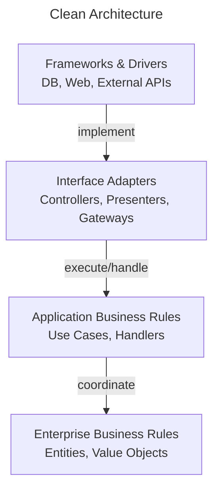

# Clean Architecture

Clean Architecture organizes software around **behavioral boundaries** and dependency rules that protect core policies from external details.

This page shows how **ForgingBlocks concepts can be projected** onto a Clean Architecture arrangement.

!!! note "Important"
    ForgingBlocks does **not** enforce Clean Architecture.
    This page presents it as an **interpretation**, not a required structure.

---

## Quick summary

Clean Architecture organizes software around **behavioral boundaries** and dependency rules that protect core policies from external details. This page shows how **ForgingBlocks concepts can be projected** onto this arrangement — **not enforced**.

Mapping:
- **Inner layers** — Domain (Entities, Value Objects) + Application (Use Cases, Handlers)
- **Outer layers** — Delivery mechanisms, technical details (Frameworks, Drivers, Interface Adapters)
- **Dependencies always point inward**

Fits when: long-term maintainability matters; strict policy/detail separation needed; multiple delivery mechanisms expected.
Consider alternatives when: simplicity > flexibility; strict rules add overhead; system is small/short-lived.

---

## Conceptual mapping

- The inner layers contain Domain and Application policies.
- The outer layers contain delivery mechanisms and technical details.
- Dependencies always point inward.

The diagram below shows the **canonical Clean Architecture view** from the literature, independent of ForgingBlocks.



## ForgingBlocks in practice

### 1. Dependency Inversion — Application defines the port, Infrastructure implements it

The application layer declares what it needs as an abstract `OutboundPort`.
The infrastructure layer provides the concrete implementation, keeping the
domain and application layers free from infrastructure details.

```python
# === Application layer (port definition) ===
from abc import abstractmethod
from collections.abc import Sequence

from forging_blocks.application.ports.outbound import RepositoryPort


class OrderRepositoryPort(RepositoryPort["Order", str]):
    """Contract for persisting and retrieving orders."""

    @abstractmethod
    async def find_by_customer(self, customer_id: str) -> list["Order"]:
        """Retrieve all orders for a given customer."""
        ...


# === Infrastructure layer (adapter) ===
class InMemoryOrderRepository(OrderRepositoryPort):
    def __init__(self) -> None:
        self._store: dict[str, "Order"] = {}

    async def get_by_id(self, id: str) -> "Order | None":
        return self._store.get(id)

    async def list_all(self) -> Sequence["Order"]:
        return list(self._store.values())

    async def save(self, aggregate: "Order") -> None:
        self._store[str(aggregate.id)] = aggregate

    async def delete_by_id(self, id: str) -> None:
        self._store.pop(id, None)

    async def find_by_customer(self, customer_id: str) -> list["Order"]:
        return [o for o in self._store.values() if o.customer_id == customer_id]
```

### 2. UseCase depending on ports through constructor injection

The use case depends only on abstractions — never on concrete adapters.
Dependencies are injected at construction time.

```python
# === Application layer (use case) ===
from dataclasses import dataclass

from forging_blocks.application.ports.inbound import ApplicationServicePort
from forging_blocks.application.ports.outbound import UnitOfWorkPort


@dataclass(frozen=True)
class PlaceOrderRequest:
    customer_id: str
    items: list[str]


@dataclass(frozen=True)
class PlaceOrderResponse:
    order_id: str


class PlaceOrderUseCase(ApplicationServicePort[PlaceOrderRequest, PlaceOrderResponse]):
    def __init__(
        self,
        order_repo: OrderRepositoryPort,
        uow: UnitOfWorkPort,
    ) -> None:
        self._order_repo = order_repo
        self._uow = uow

    async def execute(self, request: PlaceOrderRequest) -> PlaceOrderResponse:
        async with self._uow:
            order = Order.create(request.customer_id, request.items)
            await self._order_repo.save(order)
            return PlaceOrderResponse(order_id=str(order.id))
```

### 3. Domain AggregateRoot with business rules, independent of outer layers

The domain model contains pure business logic. It has no knowledge of
repositories, use cases, or infrastructure.

```python
# === Domain layer ===
from uuid import UUID, uuid4

from forging_blocks.domain.aggregate_root import AggregateRoot
from forging_blocks.domain.messages.decorators import event_dataclass
from forging_blocks.domain.messages.event import Event


@event_dataclass
class OrderPlaced(Event[dict[str, object]]):
    order_id: str
    customer_id: str
    items: list[str]


class Order(AggregateRoot[UUID, dict[str, object]]):
    MAX_ITEMS = 20

    def __init__(self, order_id: UUID) -> None:
        super().__init__(order_id)
        self._customer_id: str = ""
        self._items: list[str] = []

    @property
    def customer_id(self) -> str:
        return self._customer_id

    @classmethod
    def create(cls, customer_id: str, items: list[str]) -> "Order":
        if len(items) > cls.MAX_ITEMS:
            raise ValueError(f"Order cannot exceed {cls.MAX_ITEMS} items")
        order = cls(uuid4())
        order.apply(OrderPlaced(
            order_id=str(order.id),
            customer_id=customer_id,
            items=items,
        ))
        return order

    def _handle(self, event: Event[dict[str, object]]) -> None:
        if isinstance(event, OrderPlaced):
            self._customer_id = event.customer_id
            self._items = event.items
```

---

## When this style fits

- Long-term maintainability is a priority.
- Strict separation between policy and details is required.
- Multiple delivery mechanisms are expected.

---

## When to consider alternatives

- Simplicity outweighs flexibility.
- Strict dependency rules add unnecessary overhead.
- The system is small or short-lived.
