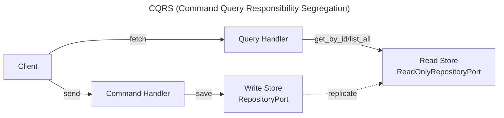

# CQRS

Command Query Responsibility Segregation separates write behavior from read behavior.

This page shows how **ForgingBlocks concepts can be projected** to support a CQRS-style design.

!!! note "Important"
    ForgingBlocks does **not** require CQRS.
    This page presents it as an **architectural pattern**, not a requirement.

---

## Quick summary

Command Query Responsibility Segregation (CQRS) separates **write behavior** from **read behavior**. This page shows how **ForgingBlocks concepts can be projected** to support CQRS — **not required**.

Mapping:
- **Commands** — Express intent to change state (`Command`, `CommandHandlerPort`, `WriteOnlyRepositoryPort`)
- **Queries** — Retrieve information (`Query`, `QueryHandlerPort`, `ReadOnlyRepositoryPort`)
- **Models may diverge** over time (separate read/write stores with replication)

Fits when: read/write workloads differ significantly; scalability dominates; eventual consistency acceptable.

---

## Conceptual mapping

- Commands express intent to change state.
- Queries retrieve information.
- Read and write responsibilities are separated.
- Models may diverge over time.

The diagram below shows a **canonical CQRS view** from the literature.



## ForgingBlocks in practice

### 1. Command and CommandHandler — write side

Commands express intent to change state. The handler uses a write-only
repository to persist the aggregate.

```python
# === Command ===
from forging_blocks.domain.messages.command import Command
from forging_blocks.domain.messages.decorators import command_dataclass


@command_dataclass
class CreateOrder(Command[dict[str, object]]):
    customer_id: str
    items: list[str]


# === CommandHandler ===
from forging_blocks.application.ports.inbound import CommandHandlerPort
from forging_blocks.application.ports.outbound import WriteOnlyRepositoryPort


class CreateOrderHandler(CommandHandlerPort[dict[str, object]]):
    def __init__(self, order_repo: WriteOnlyRepositoryPort["Order", str]) -> None:
        self._order_repo = order_repo

    async def handle(self, command: CreateOrder) -> None:
        order = Order.create(command.customer_id, command.items)
        await self._order_repo.save(order)
```

### 2. Query and QueryHandler — read side

Queries retrieve data without side effects. The handler reads from a
dedicated read-only repository, which may target a separate read model.

```python
# === Query ===
from forging_blocks.domain.messages.decorators import query_dataclass
from forging_blocks.domain.messages.query import Query


@query_dataclass
class GetOrderSummary(Query[dict[str, object]]):
    order_id: str


# === QueryHandler ===
from dataclasses import dataclass
from forging_blocks.application.ports.inbound import QueryHandlerPort
from forging_blocks.application.ports.outbound import ReadOnlyRepositoryPort


@dataclass(frozen=True)
class OrderSummary:
    order_id: str
    customer_id: str
    item_count: int


class GetOrderSummaryHandler(QueryHandlerPort[dict[str, object], OrderSummary | None]):
    def __init__(self, read_repo: ReadOnlyRepositoryPort["OrderSummary", str]) -> None:
        self._read_repo = read_repo

    async def handle(self, query: GetOrderSummary) -> OrderSummary | None:
        return await self._read_repo.get_by_id(query.order_id)
```

### 3. Separate read and write models

In CQRS, the write model may differ from the read model. The write side
works with the full aggregate; the read side serves a lightweight projection.

```python
# === Write model (command side) — full aggregate ===
from uuid import UUID

from forging_blocks.domain.aggregate_root import AggregateRoot


class Order(AggregateRoot[UUID, dict[str, object]]):
    def __init__(self, order_id: UUID) -> None:
        super().__init__(order_id)
        self._customer_id: str = ""
        self._items: list[str] = []
        self._total: float = 0.0

    def add_item(self, item: str, price: float) -> None:
        self._items.append(item)
        self._total += price


# === Read model (query side) — denormalised projection ===
@dataclass(frozen=True)
class OrderSummary:
    order_id: str
    customer_id: str
    item_count: int
    total: float
```

---

## When this style fits

- Read and write workloads differ significantly.
- Scalability concerns dominate.
- Eventual consistency is acceptable.
