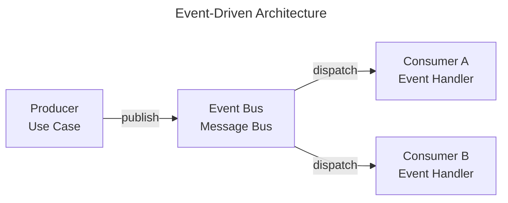

# Event-Driven Architecture

Event-Driven Architecture focuses on reacting to events and propagating facts across system boundaries.

This page shows how **ForgingBlocks abstractions can participate** in an event-driven design.

!!! note "Important"
    ForgingBlocks does **not** require an event-driven architecture.
    This page presents it as a **pattern**, not a mandate.

---

## Quick summary

Event-Driven Architecture focuses on **reacting to events** and **propagating facts** across system boundaries. This page shows how **ForgingBlocks abstractions can participate** in this design — **not required**.

Mapping:
- **Domain Events** — Facts that occurred (`Event`, past tense, immutable)
- **Event Handlers** — React to events (`EventHandlerPort`, `MessageHandlerPort[EventType, None]`)
- **Message Bus** — Routes events between components (`MessageBusPort` outbound port)
- **Loose coupling** — Components don't call each other directly

Fits when: loose coupling required; asynchronous processing desirable; frequent external system integration.

---

## Conceptual mapping

- Domain events represent facts that occurred.
- Event handlers react to those events.
- Message buses route events between components.
- Components remain loosely coupled.

The diagram below shows a **canonical event-driven flow** from the literature.



## ForgingBlocks in practice

### 1. Domain Event published from an AggregateRoot via `apply()`

Domain events are facts that have already occurred. They are raised inside
aggregates through `apply()`, which mutates state and queues the event for
publication.

```python
from uuid import UUID

from forging_blocks.domain.aggregate_root import AggregateRoot
from forging_blocks.domain.messages.decorators import event_dataclass
from forging_blocks.domain.messages.event import Event


@event_dataclass
class OrderShipped(Event[dict[str, object]]):
    order_id: str
    shipped_at: str


class Order(AggregateRoot[UUID, dict[str, object]]):
    def __init__(self, order_id: UUID) -> None:
        super().__init__(order_id)
        self._status: str = "pending"

    @property
    def status(self) -> str:
        return self._status

    def ship(self, shipped_at: str) -> None:
        if self._status != "pending":
            raise ValueError("Only pending orders can be shipped")
        self.apply(OrderShipped(
            order_id=str(self.id),
            shipped_at=shipped_at,
        ))

    def _handle(self, event: Event[dict[str, object]]) -> None:
        if isinstance(event, OrderShipped):
            self._status = "shipped"
```

### 2. EventHandler that reacts to the event

Handlers react to published events without the publisher knowing about them.

```python
from forging_blocks.application.ports.inbound import EventHandlerPort
from forging_blocks.application.ports.outbound import NotifierPort


class OrderShippedNotifier(EventHandlerPort[dict[str, object]]):
    def __init__(self, notifier: NotifierPort[str]) -> None:
        self._notifier = notifier

    async def handle(self, event: OrderShipped) -> None:
        message = f"Order {event.order_id} shipped at {event.shipped_at}"
        await self._notifier.notify(message)
```

### 3. Publishing through MessageBusPort and subscribing handlers

A message bus decouples publishers from subscribers. Handlers are registered
for specific event types; the bus routes each event to the right handlers.

```python
from forging_blocks.application.ports.inbound import ApplicationServicePort
from forging_blocks.application.ports.outbound import MessageBusPort


class PlaceOrderUseCase(ApplicationServicePort[PlaceOrderRequest, PlaceOrderResponse]):
    def __init__(
        self,
        order_repo: OrderRepositoryPort,
        event_bus: MessageBusPort[Event[dict[str, object]], None],
    ) -> None:
        self._order_repo = order_repo
        self._event_bus = event_bus

    async def execute(self, request: PlaceOrderRequest) -> PlaceOrderResponse:
        order = Order.create(request.customer_id, request.items)
        await self._order_repo.save(order)

        for event in order.collect_events():
            await self._event_bus.dispatch(event)

        return PlaceOrderResponse(order_id=str(order.id))
```

---

## When this style fits

- Loose coupling is required.
- Asynchronous processing is desirable.
- Integration with external systems is frequent.
