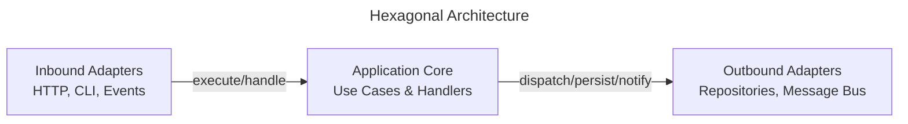

# Hexagonal Architecture

Hexagonal Architecture, also known as Ports and Adapters, emphasizes separation between core behavior and external systems.

This page shows how **ForgingBlocks concepts can be projected** onto a hexagonal arrangement.

!!! note "Important"
    ForgingBlocks does **not** enforce Hexagonal Architecture.
    This page presents it as an **interpretation** of responsibilities defined in the Reference section.

---

## Quick summary

Hexagonal Architecture (Ports and Adapters) emphasizes separation between core behavior and external systems. This page shows how **ForgingBlocks concepts can be projected** onto this arrangement — **not enforced**.

Mapping:
- **Core** — Domain (business rules) + Application (Use Cases, Handlers)
- **Inbound Ports** — Define how behavior is triggered (ApplicationServicePort, MessageHandlerPort)
- **Outbound Ports** — Define required external capabilities (RepositoryPort, MessageBusPort, UnitOfWorkPort)
- **Adapters** — Implement ports (Infrastructure: SQL repos, message brokers, HTTP clients)
- **Dependencies point toward the core**

Fits when: external systems change frequently; testing without infrastructure matters; inbound/outbound isolation needed.

---

## Conceptual mapping

- The core contains Domain and Application logic.
- Inbound ports define how behavior is triggered.
- Outbound ports define required external capabilities.
- Adapters implement those ports.
- Dependencies point toward the core.

The diagram below shows a **canonical hexagonal view** from the literature, independent of ForgingBlocks.



## ForgingBlocks in practice

### 1. Inbound Port — defining how the core is triggered

An inbound port defines a contract for driving the application. Adapters
(HTTP, CLI, tests) call this contract without the core knowing about them.

```python
from abc import abstractmethod
from dataclasses import dataclass

from forging_blocks.application.ports.inbound import ApplicationServicePort


@dataclass(frozen=True)
class RegisterCustomerRequest:
    name: str
    email: str


@dataclass(frozen=True)
class RegisterCustomerResponse:
    customer_id: str


class RegisterCustomerUseCase(
    ApplicationServicePort[RegisterCustomerRequest, RegisterCustomerResponse],
):
    """Inbound port — any adapter can trigger registration through this contract."""

    @abstractmethod
    async def execute(
        self, request: RegisterCustomerRequest,
    ) -> RegisterCustomerResponse:
        ...
```

### 2. Outbound Port — defining what the core needs

An outbound port declares a capability the core requires, without specifying
how it is fulfilled. The core depends on this abstraction, never on the
concrete implementation.

```python
from abc import abstractmethod
from uuid import UUID

from forging_blocks.application.ports.outbound import RepositoryPort


class CustomerRepositoryPort(RepositoryPort["Customer", UUID]):
    """Outbound port — the core needs customer persistence, full stop."""

    @abstractmethod
    async def find_by_email(self, email: str) -> "Customer | None":
        """Retrieve a customer by email address."""
        ...
```

### 3. Infrastructure adapter implementing the OutboundPort

The adapter fulfills the outbound port contract with a concrete technology.
Swap adapters without touching the core.

```python
class InMemoryCustomerRepository(CustomerRepositoryPort):
    def __init__(self) -> None:
        self._store: dict[UUID, "Customer"] = {}

    async def get_by_id(self, id: UUID) -> "Customer | None":
        return self._store.get(id)

    async def list_all(self) -> Sequence["Customer"]:
        return list(self._store.values())

    async def save(self, aggregate: "Customer") -> None:
        self._store[aggregate.id] = aggregate  # type: ignore[assignment]

    async def delete_by_id(self, id: UUID) -> None:
        self._store.pop(id, None)

    async def find_by_email(self, email: str) -> "Customer | None":
        for customer in self._store.values():
            if customer.email == email:
                return customer
        return None
```

---

## When this style fits

- External systems change frequently.
- Testing without infrastructure is important.
- Inbound and outbound interactions must be isolated.
