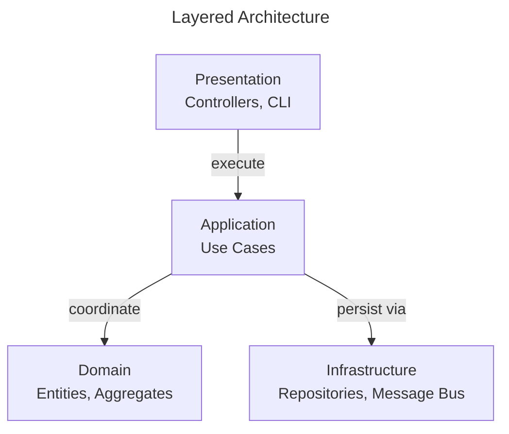

# Layered Architecture

Layered Architecture organizes software into horizontal layers, each with a distinct responsibility.

This page shows how **ForgingBlocks concepts can be projected** onto a traditional layered arrangement.

!!! note "Important"

---

## Quick summary

Layered Architecture organizes software into horizontal layers with distinct responsibilities. This page shows how **ForgingBlocks concepts can be projected** onto this arrangement — **not required**.

Mapping:
- **Presentation** — Input/output (Controllers, CLI)
- **Application** — Coordinates behavior (Use Cases)
- **Domain** — Problem-space concepts (Entities, Aggregates)
- **Infrastructure** — Technical implementations (Repositories, Message Bus)
- **Dependencies flow downward**

Fits when: system is relatively small; architectural complexity not required; simplicity/familiarity prioritized.
Consider alternatives when: strict dependency control needed; inbound/outbound isolation required; message-driven/async workflows central.

---

- Presentation handles input and output concerns.
- Application coordinates behavior.
- Domain contains problem-space concepts.
- Infrastructure provides technical implementations.
- Dependencies typically flow downward.

The diagram below shows a **canonical layered view** from the literature, independent of ForgingBlocks.



## ForgingBlocks in practice

### 1. Presentation calling Application via InboundPort

The presentation layer depends on the application's inbound port — never on
the concrete service. This lets you swap controllers, CLIs, or test harnesses.

```python
# === Presentation layer — HTTP controller ===
from forging_blocks.application.ports.inbound import ApplicationServicePort


class OrderController:
    def __init__(
        self,
        place_order_use_case: ApplicationServicePort[
            PlaceOrderRequest, PlaceOrderResponse
        ],
    ) -> None:
        self._use_case = place_order_use_case

    async def post(self, body: dict[str, object]) -> dict[str, object]:
        request = PlaceOrderRequest(
            customer_id=str(body["customer_id"]),
            items=list(body["items"]),  # type: ignore[arg-type]
        )
        response = await self._use_case.execute(request)
        return {"order_id": response.order_id}
```

### 2. Application using Domain Entity and calling Infrastructure via OutboundPort

The application layer orchestrates domain objects and delegates persistence
through outbound ports. It has no knowledge of concrete infrastructure.

```python
# === Application layer — use case ===
from uuid import UUID

from forging_blocks.application.ports.inbound import ApplicationServicePort
from forging_blocks.application.ports.outbound import UnitOfWorkPort


class PlaceOrderUseCase(ApplicationServicePort[PlaceOrderRequest, PlaceOrderResponse]):
    def __init__(
        self,
        order_repo: OrderRepositoryPort,
        customer_repo: CustomerRepositoryPort,
        uow: UnitOfWorkPort,
    ) -> None:
        self._order_repo = order_repo
        self._customer_repo = customer_repo
        self._uow = uow

    async def execute(self, request: PlaceOrderRequest) -> PlaceOrderResponse:
        async with self._uow:
            customer = await self._customer_repo.get_by_id(UUID(request.customer_id))
            if customer is None:
                raise ValueError("Customer not found")

            order = Order.create(str(customer.id), request.items)
            await self._order_repo.save(order)
            return PlaceOrderResponse(order_id=str(order.id))
```

### 3. Infrastructure implementing the OutboundPort

The infrastructure layer provides concrete adapters for each port. These
adapters are replaceable without affecting any layer above.

```python
# === Infrastructure layer — in-memory adapter ===
from collections.abc import Sequence


class InMemoryOrderRepository(OrderRepositoryPort):
    def __init__(self) -> None:
        self._store: dict[str, "Order"] = {}

    async def get_by_id(self, id: str) -> "Order | None":
        return self._store.get(id)

    async def list_all(self) -> Sequence["Order"]:
        return list(self._store.values())

    async def save(self, aggregate: "Order") -> None:
        self._store[str(aggregate.id)] = aggregate

    async def delete_by_id(self, id: str) -> None:
        self._store.pop(id, None)
```

---

## When this style fits

- The system is relatively small.
- Architectural complexity is not required.
- Simplicity and familiarity are prioritized.

---

## When to consider alternatives

- Strict dependency control is required.
- Inbound and outbound interactions must be isolated.
- Message-driven or asynchronous workflows are central.
