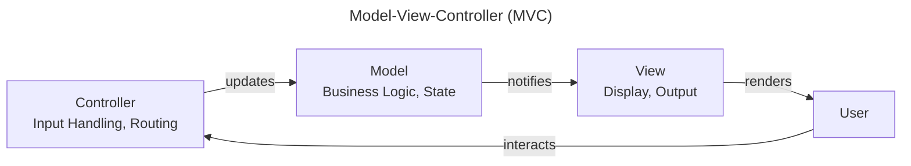

# Model-View-Controller (MVC)

Model-View-Controller separates presentation into three interconnected components — **Model** (data + business logic), **View** (display), and **Controller** (input handling).

This page shows how **ForgingBlocks concepts can be projected** onto an MVC arrangement.

!!! note "Important"
    ForgingBlocks does **not** enforce MVC.
    This page presents it as an **interpretation**, not a required structure.

---

## Quick summary

Model-View-Controller (MVC) separates presentation into three interconnected components — **Model** (data + business logic), **View** (display), and **Controller** (input handling). This page shows how **ForgingBlocks concepts can be projected** onto this arrangement — **not enforced**.

Mapping:
- **Model** — Domain (Entities, Value Objects, Aggregates) + Application (Use Cases, business logic)
- **View** — Presentation (rendering, output formatting)
- **Controller** — Presentation (input handling, routing, request parsing)
- **Ports keep Model decoupled** from View and Controller

Fits when: user-facing applications with clear input/display separation; traditional request-response flows; frameworks assume MVC.
Consider alternatives when: model must be fully isolated from presentation; event-driven updates dominate; complex UI synchronization required.

---

## Conceptual mapping

- The **Model** holds business logic and state (Domain + Application).
- The **View** renders output and displays state.
- The **Controller** handles input, routes requests, and parses parameters.
- ForgingBlocks ports keep the Model decoupled from the View and Controller.

The diagram below shows a **canonical MVC view** from the literature, independent of ForgingBlocks.



---

## ForgingBlocks in practice

### Model: Domain Entities and Value Objects

The **Model** layer maps cleanly to ForgingBlocks Domain concepts. Entities represent identity-bearing objects, while Value Objects encapsulate validated, immutable values.

```python
from forging_blocks.domain.entity import Entity
from forging_blocks.domain.value_object import ValueObject


class Email(ValueObject[str]):
    __slots__ = ("_value",)

    def __init__(self, value: str) -> None:
        super().__init__()
        if "@" not in value:
            raise ValueError("Invalid email")
        self._value = value

    @property
    def value(self) -> str:
        return self._value


class User(Entity[int]):
    def __init__(self, user_id: int, email: Email) -> None:
        super().__init__(user_id)
        self._email = email
        self._active = True

    @property
    def email(self) -> Email:
        return self._email

    def deactivate(self) -> None:
        self._active = False
```

### Controller: Application Service Ports

The **Controller** can be backed by an `ApplicationServicePort` — an inbound port that defines the contract for use case execution. The controller parses input and delegates to the port.

```python
from abc import abstractmethod
from dataclasses import dataclass
from forging_blocks.application.ports.inbound.application_service_port import (
    ApplicationServicePort,
)


@dataclass(frozen=True)
class CreateUserRequest:
    email: str


@dataclass(frozen=True)
class CreateUserResponse:
    user_id: int
    email: str


class CreateUserPort(
    ApplicationServicePort[CreateUserRequest, CreateUserResponse]
):
    @abstractmethod
    async def execute(self, request: CreateUserRequest) -> CreateUserResponse:
        """Create a new user from the given request."""
```

### Result-returning Controller

A concrete controller delegates to the use case port and translates the outcome for the View using `Result`.

```python
from forging_blocks.foundation.result import Ok, Err, Result


class UserController:
    def __init__(self, create_user: CreateUserPort) -> None:
        self._create_user = create_user

    async def handle(
        self, request: CreateUserRequest,
    ) -> Result[CreateUserResponse, str]:
        try:
            response = await self._create_user.execute(request)
            return Ok(response)
        except ValueError as exc:
            return Err(str(exc))
```

---

## When this style fits

- User-facing applications with clear input/display separation.
- Traditional request-response flows.
- Frameworks assume an MVC structure.

---

## When to consider alternatives

- The Model must be fully isolated from all presentation concerns.
- Event-driven updates dominate.
- Complex UI synchronization is required.
