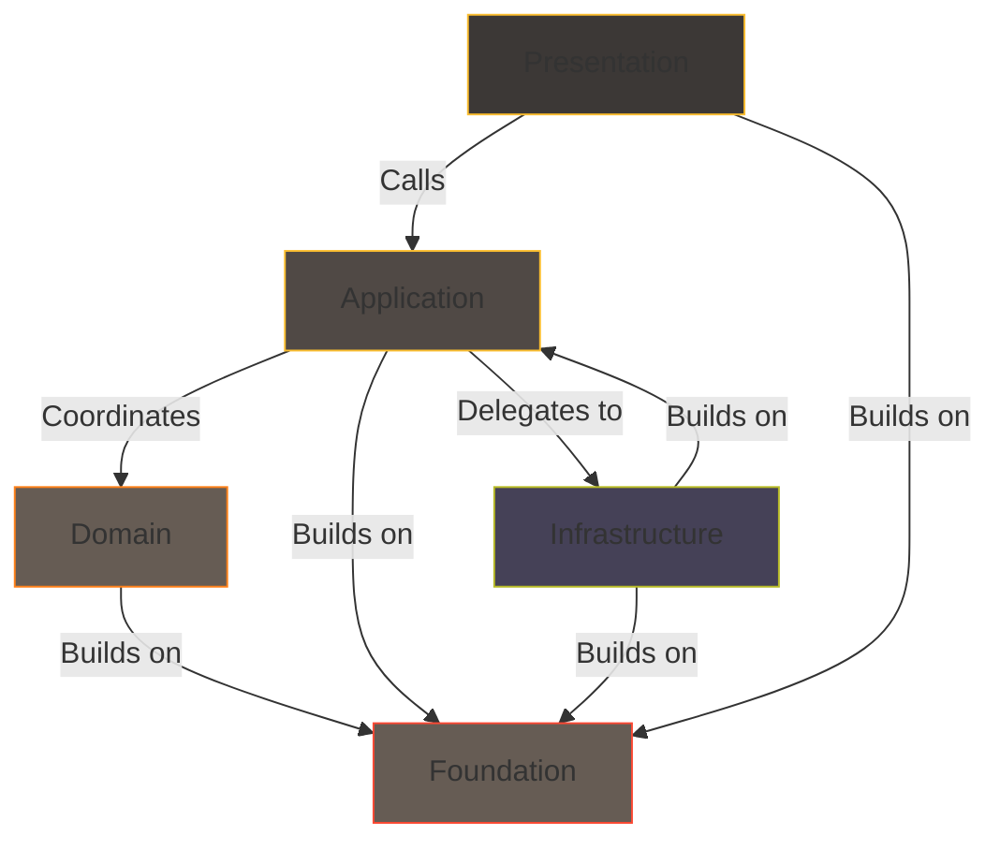

# Blocks Structure
## How forging-blocks is organized internally

This section describes how **forging-blocks itself** is structured into blocks — named groups of code sharing a responsibility and boundary. It documents the library's own internal organization, not a prescription for how you should structure your project.

!!! warning "Foundation is not a canonical block name"
    "Foundation" is the library's own term for its innermost, zero-dependency block.
    Your own project's innermost block should carry a name meaningful to your domain —
    `Core`, `Shared`, `Common`, or a domain-specific term. Do not copy the library's
    internal block names into your project.

---
## Quick summary

The forging-blocks library is organized into five blocks, each with a distinct responsibility:

- **Foundation** — Reusable low-level abstractions (`Result`, `Port`, `Mapper`, errors, meta utilities). No dependencies.
- **Domain** — Problem space concepts (Entities, Value Objects, Aggregates, Domain Errors). Depends only on Foundation.
- **Application** — Orchestration contracts (Use Cases, Message Handlers, Inbound/Outbound Ports). Depends on Domain + Foundation.
- **Infrastructure** — Technology-agnostic implementations (in-memory repos, OS filesystem, stdlib logging). Implements Application's outbound ports.
- **Presentation** — Entry-point abstractions (adapters, middleware, error handling). Calls Application; stays thin.

Dependency rules (inward-pointing): Foundation has no deps → Domain depends on Foundation → Application depends on Domain + Foundation; Infrastructure and Presentation depend on Application + Foundation.

**Block ≠ Layer** — Blocks are architecture-neutral named boundaries within the library; they can be interpreted as layers if that mental model helps.
---

The library's five blocks and their dependency relationships:

- **Foundation** – reusable, low-level abstractions.
- **Domain** – problem-space concepts and rules.
- **Application** – workflow contracts and coordination abstractions.
- **Infrastructure** – technology-agnostic adapter implementations.
- **Presentation** – entry-point and interaction abstractions.

This diagram illustrates how the library's blocks relate to each other.

---
## Block vs Layer

In forging-blocks, a **block** is an architecture-neutral concept — a named group of code sharing a responsibility and boundary.

Blocks can be mentally mapped to layers if that model is familiar: Foundation maps to a shared kernel, Domain and Application map to a core (business logic), and Infrastructure and Presentation map to outer rings. But the library does not enforce any layering scheme.

Blocks are **named boundaries**. Code lives in exactly one block, imports respect the dependency direction, and each block's public API is explicit about what it offers and what it needs (ports).

!!! note "Internal Dependency Rules"
    The library follows these rules internally:

    - Foundation depends on nothing.
    - Domain depends only on Foundation.
    - Application depends on Domain and Foundation.
    - Infrastructure depends on Application (for outbound port contracts) and Foundation.
    - Presentation depends on Application and Foundation.

    These rules maintain clear boundaries within the library itself.
---

## Foundation

**Responsibility:** small, reusable abstractions used throughout the library.

Provides:

- `Result`, `Ok`, `Err`
- `Port` and port-related protocols (`InboundPort`, `OutboundPort`)
- `Identified` protocol for objects carrying an identity
- `Mapper` protocol for structured transformation
- `Debuggable` protocol for consistent debug representations
- `Error` and its structured descendants (validation, rule violation, field, combined) for predictable error handling
- `FinalMeta`, `FinalABCMeta`, and `runtime_final` for runtime enforcement of method finality

The Foundation block contains abstractions that support the other blocks.

!!! note "Purpose of Foundation block"
    The Foundation block provides shared abstractions.
    It defines the core building blocks that other blocks depend on.

Foundation abstractions are used by Domain, Application, Infrastructure, and Presentation.

---

## Domain

**Responsibility:** model the problem space — concepts, rules, and invariants.

The Domain block provides:

- **Types** for meaningful concepts: `Entity`, `AggregateRoot`, `ValueObject`
- **Rules and invariants** enforced through types and methods
- **Domain events** for significant occurrences (`Event` base class)

This block depends only on Foundation and knows nothing about HTTP, SQL, queues, filesystems, or any technical details.

!!! note "Meaning of Domain"
    In **Psychology**, a *domain* is simply an area of knowledge or activity.

    In forging-blocks, the **Domain** block holds the abstractions for modeling the problem space — concepts and rules that describe *what* a system is about, not *how* it is implemented.

!!! note "Dependency rule"
    The Domain depends only on **Foundation**.

    It does not depend on Application, Infrastructure, or Presentation, so that domain abstractions remain independent of technical concerns.
---

## Application

**Responsibility:** define workflow contracts and coordination abstractions.

The Application block provides:

- **InboundPort abstractions** (`UseCase`, `ApplicationServicePort`, `MessageHandlerPort`) — contracts for operations the system offers
- **OutboundPort abstractions** (`RepositoryPort`, `MessageBusPort`, `NotifierPort`, `UnitOfWorkPort`) — contracts for dependencies the system needs
- **Workflow base classes** that define the shape of business operations

The Application block depends on Domain types and defines abstract ports that Infrastructure implements. It contains no technical implementation details.

!!! note "Dependency rule"
    Application depends on Domain and Foundation.
    It defines both InboundPort and OutboundPort contracts.
    Infrastructure implements the OutboundPort contracts (Dependency Inversion Principle).

---

## Infrastructure
**Responsibility:** provide technology-agnostic implementations of outbound port contracts.

The Infrastructure block ships with:

- **In-memory repositories** (`InMemoryReadRepository`, `InMemoryWriteRepository`) and **event stores** (`InMemoryEventStore`)
- **In-memory messaging** (`InMemoryMessageBus`, `InMemoryEventBus`)
- **Stdlib-based implementations** (`OSFileSystem`, `StdlibLogger`)
- **Unit of Work** (`InMemoryUnitOfWork`)

These are first-class implementations, not test doubles — they use only the Python standard library and carry no third-party dependencies.

!!! note "Dependency Rule"
    Infrastructure depends on Application (for outbound port contracts) and Foundation.
    No third-party dependencies are allowed in this library.
    Application-specific adapters (SQL databases, message brokers, HTTP clients) belong in consuming projects.

---

## Presentation

**Responsibility:** provide entry-point and interaction abstractions.

The Presentation block provides:

- **Adapter patterns** for connecting external inputs to Application ports
- **Middleware abstractions** for cross-cutting concerns
- **Error handling** utilities for boundary translation

The Presentation block calls the Application block through inbound ports. It stays thin so that behavior remains testable and reusable.
